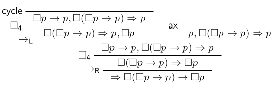

# genz - A Generic Sequent Calculus Prover with Zippers

Covering the following logics:

- Propositional: CPL, IPL
- Modal: K, K4, T, D, D4, S4, GL

## Web interface

You can use the prover online at <https://tools.malv.in/genz-web/>.

## Formula Syntax

Both ASCII and Unicode symbols are allowed. Here are some example formulas:

- `[](p -> []p) -> []p`
- `[]p & []q <-> []p | []q` which unfolds to `((☐p ∧ ☐q) → (☐p v ☐q)) ∧ ((☐p v ☐q) → (☐p ∧ ☐q))`.
- `<><>p -> <>p` which unfolds to `(☐((☐(p → ⊥) → ⊥) → ⊥) → ⊥) → (☐(p → ⊥) → ⊥)`

| Symbols                  | Meaning                 | Note                             |
|--------------------------|-------------------------|----------------------------------|
| `p`, `q`, `bla`, ...     | atomic propositions     |                                  |
| `true`                   | top (constant true)     |                                  |
| `false`                  | bottom (constant false) |                                  |
| `~`, `¬`                 | negation (not)          | abreviation for `... -> false`   |
| `&`                      | conjunction (and)       | primitive                        |
| `\|`                     | disjunction (or)        | primitive                        |
| `->`, `-->`, `=>`, `→`,  | implication (if-then)   | primitive                        |
| `<->`, `<-->`, `<=>`,`↔` | bi-implication (iff)    | abbreviation using `->` and `&`. |
| `<>`, `<a>`, `◇`         | diamond (possible)      | abbreviation for `~ [] ~ ...`    |
| `[]`, `[a]`, `☐`         | box (necessary)         | primitive                        |

## Building

You should have the Haskell build tool `stack` installed, via [ghcup](https://www.haskell.org/ghcup/).
For proof visualization, optonally you may want to install [`graphviz`](https://graphviz.org/).

To build the project run `stack build`.

## CLI program

To install the `genz` and the `genz-web` binaries, just run `stack install` in this repository.

### CLI examples

We can prove a formula given directly with `-F` or from a file with `-f` or from standard input with `--stdin`.
By default the modal logic `K` is used.

```
$ genz -F "[]p -> [][]p"
False

$ echo "p | ~p" > example.txt
$ genz -f example.txt
True
$ genz -f example.txt --logic IPL
False

$ echo "[][]p -> [][][][]p" | genz --stdin --logic S4
True
```

Get help:

```
$ genz --help
genz - a generic sequent calculus prover with zippers

Usage: genz ((-F|--formula FORMULA) | (-f|--file FILE) | (-s|--stdin))
            [-t|--tree] [-p|--proof] [-l|--logic LOGIC]

  Prove the given FORMULA or the formula in FILE or STDIN.

Available options:
  -F,--formula FORMULA     Formula
  -f,--file FILE           Input file
  -s,--stdin               Read from stdin
  -t,--tree                Use standard trees (default is to use zippers).
  -p,--proof               Print the (partial) proof (default is only
                           True/False).
  -l,--logic LOGIC         Logic to use: CPL, IPL, D, D4, GL, K, K4, S4, T
                           (default: K)
  -h,--help                Show this help text
```

Benchmarking zipper vs tree representation (for an unprovable formula):
```
$ /usr/bin/time -f%E genz -F "[]([]p->p) -> [][][][][][][][][][][][][][][][][][]p" --logic K4
False
0:00.01
$ /usr/bin/time -f%E genz -F "[]([]p->p) -> [][][][][][][][][][][][][][][][][][]p" --logic K4 --tree
False
0:03.44
```

## Haskell examples

You can use `stack ghci` to run examples like this:

    stack ghci lib/Logic/Modal/K.hs lib/FormM.hs

    ghci> FormM.multiVerK 3
    (☐(3 → (4 → (5 → 1))) → (☐3 → (☐4 → (☐5 → ☐1))))
    ghci> FormM.extraAtK 3
    (☐(3 → (4 → (5 → (2 → 1)))) → (☐3 → (☐4 → (☐5 → ☐1))))

    ghci> isProvableT k (FormM.multiVerK 3)
    True
    ghci> isProvableZ k (FormM.multiVerK 3)
    True
    ghci> isProvableT k (FormM.extraAtK 3)
    False
    ghci> isProvableZ k (FormM.extraAtK 3)
    False

In the above `k` is `Logic.Modal.K.k :: Logic`, i.e. the proof system.

## LaTeX output

The prover can generate code for [bussproofs](https://ctan.org/pkg/bussproofs).

    stack ghci lib/GL.hs lib/MForm.hs

    ghci> texFile $ head $ proveZ GL.gl lobaxiom

This will write code into `temp.tex` and then run `pdflatex` on it.
The result looks as follows.



## Tests

To run all tests locally, run `stack test`.
This should not take more than five minutes.

The tests are also run automatically for each commit,
see <https://github.com/XiaoshuangYang999/Sequent-Calculus-With-Zippers/actions> for results.

## Benchmarks

You should have LaTeX and [pandoc](https://pandoc.org/) installed.

To run the benchmarks for a small selection of formulas,
run `make bench/runtime.pdf` and `make bench/memory.pdf`.
The runtime benchmark will take around 30 minutes, the memory benchmark less than one minute.

To run benchmarks on a larger set of formulas,
run `make bench/runtime-all.pdf` and `make bench/memory-all.pdf`.
Note: this runtime benchmark will take multiple hours.

Example results are available at
<https://github.com/XiaoshuangYang999/Sequent-Calculus-With-Zippers/releases>.

## References

The code in this repository was originally developed as part of the following master thesis:

- Xiaoshuang Yang: *Sequent Calculus with Zippers*.
  University of Amsterdam, 2024.
  <https://eprints.illc.uva.nl/id/eprint/2354>

The original code from the thesis can be found in the `thesis-version` branch.
Ongoing updates and improvements are included in the `main` branch.
